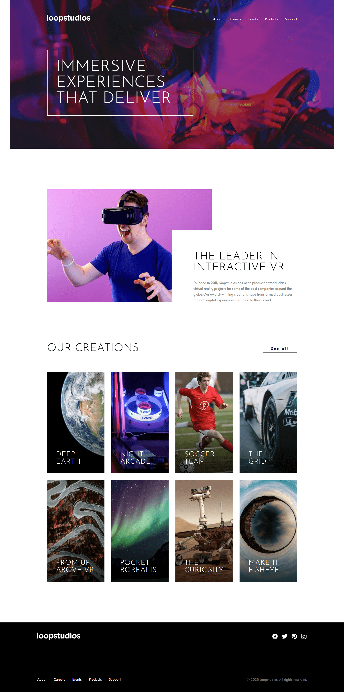

# Frontend Mentor - Loopstudios Landing Page

## Welcome! 👋

My challenge was to build out the **Loopstudios Landing Page** and make it as close to the provided design as possible. I was free to use any tools I liked to complete the challenge, making it a great opportunity to improve my layout and responsive design skills.

I ensured that my users could:

- View the optimal layout for the site depending on their device's screen size
- See hover states for all interactive elements on the page
- Navigate the mobile menu with a functional toggle (optional JavaScript)

## Table of contents

- [Overview](#overview)
  - [The challenge](#the-challenge)
  - [Screenshot](#screenshot)
  - [Links](#links)
- [Author](#author)

## Overview

### The challenge

This challenge was a great opportunity for me to practice **CSS Grid, Flexbox, and responsive design techniques**. I focused on structuring my HTML semantically and styling it with pure CSS without relying on a framework.

### Screenshot

### Links

- Solution URL: [GITHUB SOURCE](https://github.com/pettik/FrontendMentor--loopstudios-landing-page)
- Live Site URL: [LIVE SITE 🌐](https://pettik-loopstudios.netlify.app/)

## Author

- Website - [Petr Bednarski](https://github.com/pettik)
- Frontend Mentor - [@pettik](https://www.frontendmentor.io/profile/pettik)
